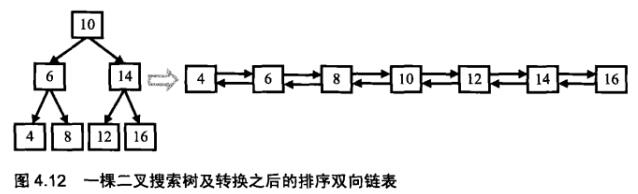
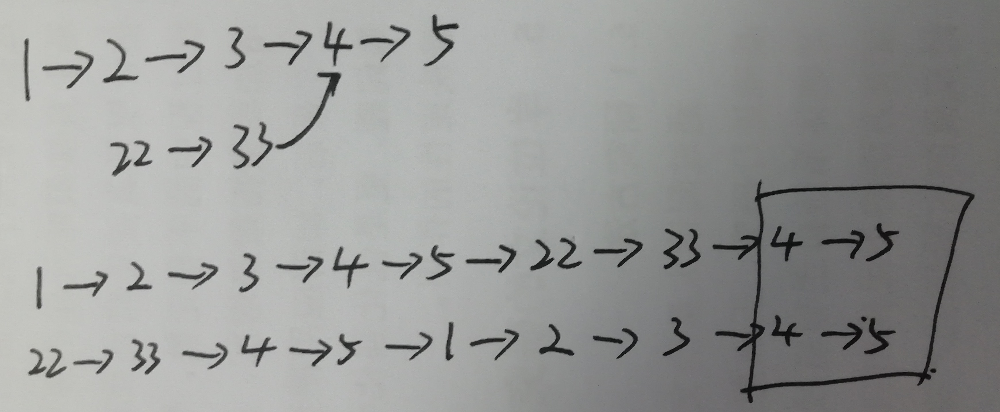

牛客网，《剑指offer》刷题记录。  

本程序全部使用`clang++ 3.9` 编译通过。   

# 01 - [二维数组中的查找](./01-serchInMartix.cpp)

题目描述：  
	在一个二维数组中（每个一维数组的长度相同），每一行都按照从左到右递增的顺序排序，每一列都按照从上到下递增的顺序排序。请完成一个函数，输入这样的一个二维数组和一个整数，判断数组中是否含有该整数。 
	
解题思路：  
	矩阵是有序的，对于行，从左往右下标变大，元素值递增；对于列从上往下，列下标变大，元素值递增；
	因此可以从矩阵的右上角开始搜索，当target元素比当前元素大时，行索引+1往下方搜索；否则列索引-1往左边搜索。
	

# 02 - [替换空格](./02-replaceSpace.cpp) 

题目描述：  
	请实现一个函数，将一个字符串中的每个空格替换成“%20”。例如，当字符串为We Are Happy.则经过替换之后的字符串为We%20Are%20Happy。
	
解题思路：  
	从后往前移动，两个指针，一个指向替换空格后的字符串的尾部（pw），另一个指向替换前字符串的尾部(pr)。如果遇到空格就在pw处写入替换的字符，否则就将pr处的字符赋值给pw。


# 03 - [从尾到头打印链表](./03-printListFromTailToHead.cpp) 

题目描述：  
	输入一个链表，按链表值从尾到头的顺序返回一个ArrayList。

解题思路：  
	此题和使用递归逆转单链表类似，但是更简单一些，可以设置一个全局或者似有的vector<int>容器，递归返回的时候，将节点的value域push_back给vector，最后返回构造的vector即可。

# 04 -  重建二叉树

题目描述：  
	输入某二叉树的前序遍历和中序遍历的结果，请重建出该二叉树。假设输入的前序遍历和中序遍历的结果中都不含重复的数字。例如输入前序遍历序列{1,2,4,7,3,5,6,8}和中序遍历序列{4,7,2,1,5,3,8,6}，则重建二叉树并返回。
	
解题思路：  
	先根序的第一个元素一定为根元素，中根序中根左边的元素一定在左子树，右边的元素一定在右子树。可以通过递归进行树的重建。
	目前还没写出来。

# 05 - [用两个栈来实现一个队列](./05-stack-make-queue.cpp)

题目描述：  
	完成队列的Push和Pop操作。 队列中的元素为int类型。    

解题思路：  
	两个栈，一个作为调整元素顺序的buffer使用。

 - 入队时：先将stack1的元素都pop到stack2中去；然后将新元素push到stack1；再将stack2中的pop回stack1;
- 出队时：直接从stack1 pop一个元素。

# 06 -  [求旋转数组的最小数字](./06-minNumberInRotateArray.cpp)

题目描述：  

把一个数组最开始的若干个元素搬到数组的末尾，我们称之为数组的旋转。 输入一个非减排序的数组的一个旋转，输出旋转数组的最小元素。 例如数组{3,4,5,1,2}为{1,2,3,4,5}的一个旋转，该数组的最小值为1。 NOTE：给出的所有元素都大于0，若数组大小为0，请返回0。  

解题思路：  

1.  最简单的思路就是顺序查找，时间复杂度为O(n)， 我就是采用这个思路的；
2. 由于是有序数组，自然想到用二分查找，可以将时间复杂度降低到O(logN)，但是旋转的有序数组还有些不同：
   - 旋转后的数组，前边的元素都大于后边的元素，最小值即为两个递增子数组的分界点；
   - 用`left`和`right`指针分别指向第一个和最后一个元素，`mid`指向中间元素，则如果中间元素**大于**`left`元素，则最小值一定在中间元素的后边，令`left` = `mid`； 反之，如果中间元素**小于**`left`元素，则最小值一定在之间元素的前边，令`right` = `mid;`
   - 循环结束的条件：`left`指向前边递增数组的最大值，`right`指向后边递增数组的最小值，即`right-left == 1`;
   - 此题目中要求是**非减排序数组**，也就是说会出现元素值相等的情况，如果`left mid right`指向的三个元素均相等，则没有办法使用上边的思路求解，只能在区间内顺序查找。


# 07 - [斐波那契数列](./06-Fibonacci.cpp)  

题目描述：  

​	斐波那契数列的表达式如下所示，第0 项为0 ，求第n  项的值，n<=39

- 
- 
- )

解题思路：

1. 递归解法，时间复杂度为)；
2. 循环解法， 时间复杂度为)；
3. 矩阵求解， 时间复杂度为)；
4. 公式求解， 时间复杂度为)，但是涉及到无理数计算，会损失精度；


关于矩阵求解方式  


**矩阵快速幂**

例如求

  9次乘法    
*(A*A)*(A*A)*(A*A)=A*(A^2)^4 ) 6次乘法    
^2)^2)  4次乘法   


# 08 - [跳台阶](./08-jumpFloor.cpp)


题目描述：  

一只青蛙一次可以跳上1级台阶，也可以跳上2级。求该青蛙跳上一个n级的台阶总共有多少种跳法（先后次序不同算不同的结果）。  


解题思路：    

假设共有n个台阶，共f(n)种跳法。  

- 假定第一次跳一个台阶，那么剩下n-1个台阶，共f(n-1)种跳法；
- 假定第一次跳两个台阶，那么剩下n-2个台阶，共f(n-2)种跳法；
- 则n个台阶时共f(n-1)+f(n-2)种跳法，递归即可求出总跳法；
- 当n=1时 f(n) = 1, 当n=2时f(n) = 2， 即构造了一个斐波那契数列。  


# 09 - [变态跳台阶](./09-jumpFloorII.cpp)

题目描述：  

一只青蛙一次可以跳上1级台阶，也可以跳上2级……它也可以跳上n级。求该青蛙跳上一个n级的台阶总共有多少种跳法。  

解题思路：  

也可以循环调用第八题中写好的递归函数，但是此种解法开销太大，看到有网友推导出的公式，感慨数学分析才是王道啊。推导过程如下：  

- f(1) = 1
- f(2) = f(2-1) + f(2-2)
-  .....
- f(n-1) = f((n-1)-1) + f((n-1)-2 + ... + f(0) = f(0) + f(1) +f(2) + ... + f(n-2)  
- f(n) = f(n-1) + f(n-2) + ... + f(0) = f(0) + f(1) + f(2) + ... + f(n-1) = \** f(n-1) + f(n-1) \**  此处的第二个f(n-1)即为上式
- 故：f(n) = 2*f(n-1)

#  10 - [矩形覆盖问题](./10-rectCover.cpp)

题目描述：  

我们可以用2*1的小矩形横着或者竖着去覆盖更大的矩形。请问用n个2*1的小矩形无重叠地覆盖一个2*n的大矩形，总共有多少种方法？  

解题思路：  

很明显此题也可以用递归的方式实现，推导过程见下图; 此外对于更一般的问题：用1×m的方块去覆盖mxn的区域时，递推公式为 f(n) = f(n-1)+f(n-m) (n>m)    


# 11 - [二进制中1的个数](./11-NumberOf1.cpp)

题目描述：  

输入一个整数，输出该数二进制表示中1的个数。其中负数用补码表示。  

解题思路：  

此题目刚开始做的时候没理解题目意思，后来看了正确答案才弄明白题目的意思：随便给定一个32位的整数，统计其二进制中1的个数，即正数用原码表示，负数用补码表示。不过答案给的解法也很精妙。  

> **如果一个整数不为0，那么这个整数至少有一位是1。如果我们把这个整数减1，那么原来处在整数最右边的1就会变为0，原来在1后面的所有的0都会变成1(如果最右边的1后面还有0的话)。其余所有位将不会受到影响。**
>
> **举个例子：一个二进制数1100，从右边数起第三位是处于最右边的一个1。减去1后，第三位变成0，它后面的两位0变成了1，而前面的1保持不变，因此得到的结果是1011.我们发现减1的结果是把最右边的一个1开始的所有位都取反了。这个时候如果我们再把原来的整数和减去1之后的结果做与运算，从原来整数最右边一个1那一位开始所有位都会变成0。如1100&1011=1000.也就是说，把一个整数减去1，再和原整数做与运算，会把该整数最右边一个1变成0.那么一个整数的二进制有多少个1，就可以进行多少次这样的操作。**

# 12 - [数值的整数次方](./12-Power.cpp)

题目描述：  

给定一个double类型的浮点数base和int类型的整数exponent。求base的exponent次方。  

解题思路：  

[快速降幂乘](https://blog.csdn.net/hkdgjqr/article/details/5381028)


# 13 - [调整数组顺序使奇数位于偶数前面](./13-reOrderArray.cpp)

题目描述：  

输入一个整数数组，实现一个函数来调整该数组中数字的顺序，使得所有的奇数位于数组的前半部分，所有的偶数位于数组的后半部分，并保证奇数和奇数，偶数和偶数之间的相对位置不变。  

解题思路：  

要保证稳定性（偶数和偶数之间的先对位置不变）可以使用冒泡排序的思路，相邻的两个元素比较如果偶数在前边就交换两个元素的位置。


# 14 - [查找单向链表的倒数第k个节点](./14-FindKthTotail.cpp)

题目描述：  

输入一个链表，输出该链表中倒数第k个结点。  

解题思路：  

- 第一反应是用栈来实现，先遍历链表，将元素依次入栈，然后出栈的时候开始计数，当计到k时，返回栈顶元素。但是此方法需要占用额外的存储空间。  
- 第二种方法是，用两个指针，一个快指针fast_p，一个慢指针slow_p。快指针先向前移动k个元素，然后快指针和慢指针一起向后移动，当快指针到达链表尾部的时候，慢指针刚好指向目标节点。  


# 15 - [反转链表](./15-ReverseList.cpp)

题目描述：  

输入一个链表，反转链表后，输出新链表的表头。  


解题思路：  

- 递归： 刚开始比较纠结，新链表的表头指针怎么传递，分析后发现重构链表的指针域时不需要用到递归的返回值，递归的返回值可以用来传递新链表的表头指针，通过层层递归返回最终返回给调用递归处。
- 用栈


# 16 - [合并两个排序链表](./16-MergeSortedList.cpp)

题目描述：   

输入两个单调递增的链表，输出两个链表合成后的链表，当然我们需要合成后的链表满足单调不减规则。

  

解题思路：    

这道题的思路都是一样的，不过看到网友的代码，真的好简洁。学习一下。  


# 17 - [树的子结构](./17-HasSubtree.cpp)

题目描述：  

输入两棵二叉树A，B，判断B是不是A的子结构。（ps：我们约定空树不是任意一个树的子结构）  

解题思路：  

两种解法，第一种递归解法：先判断根结点是否相等，如果相等判断两个子树结构是否完全一致，否则递归判断A的左右子树是否和B的根节点相同。第二种使用先序遍历解法，先用先序遍历两个二叉树并构造两个先序遍历序列，然后在两个序列中进行比较，看A是否含有B的字串。  

牛客网和leetcode的OJ系统不同，因此此题程序不能通过leetcode 572题。  

# 18 - [二叉树的镜像](./18-Mirror.cpp)

题目描述：  

操作给定的二叉树，将其变换为源二叉树的镜像。

输入描述:

```
二叉树的镜像定义：源二叉树 
    	    8
    	   /  \
    	  6   10
    	 / \  / \
    	5  7 9 11
    	镜像二叉树
    	    8
    	   /  \
    	  10   6
    	 / \  / \
    	11 9 7  5
```

解题思路：  

交换左右指针项，然后递归调用左子树和右子树。  


# 19 - [顺时针打印矩阵](./19-printMatrix.cpp)

题目描述：  

输入一个矩阵，按照从外向里以顺时针的顺序依次打印出每一个数字，例如，如果输入如下4 X 4矩阵： 1 2 3 4 5 6 7 8 9 10 11 12 13 14 15 16 则依次打印出数字1,2,3,4,8,12,16,15,14,13,9,5,6,7,11,10.

解题思路：  

用四个变量`left, right, top, bottom`表示矩阵范围，然后大循环内四个不同方向的小循环。注意边界值的情况。  


# 20 - [包含min函数的栈](./20-minStack.cpp)

题目描述：  

定义栈的数据结构，请在该类型中实现一个能够得到栈中所含最小元素的min函数（时间复杂度应为O（1））。

解题思路：  

  设置两个栈，一个数据栈，一个辅助栈，数据栈保存所有数据，辅助栈保存当时的最小值。当入栈时，如果辅助栈为空，则分别将数据压入数据栈和辅助栈，否则先比较要压入栈的数据和辅助栈栈顶元素的大小，如果小于辅助栈的栈顶元素，则压入数据栈的同时也压入辅助栈，否则只压入数据栈。当出栈时，如果数据栈和辅助栈栈顶元素相同，则同时出数据栈和辅助栈，否则只出数据栈。求`min`时，直接返回辅助栈的栈顶元素即可。  


# 21 - [栈的压入、弹出序列](./21-IsPopOrder.cpp)

题目描述：  

输入两个整数序列，第一个序列表示栈的压入顺序，请判断第二个序列是否可能为该栈的弹出顺序。假设压入栈的所有数字均不相等。例如序列1,2,3,4,5是某栈的压入顺序，序列4,5,3,2,1是该压栈序列对应的一个弹出序列，但4,3,5,1,2就不可能是该压栈序列的弹出序列。（注意：这两个序列的长度是相等的）    

解题思路：  

由于压入栈的数字均不相同，所以一边压栈一边和出栈序列对比，如果栈顶元素和出栈序列的第一个数字相同，则开始出栈，出栈同时出栈序列的`index++`。压入下一个元素的时候做上边同样的操作。即不相等就压栈，相同就开始出栈，出到不相同的元素则继续压下一个元素。当压栈序列遍历完了后，如果栈为空，则说明出栈序列是正确的，否则出栈序列不是该入栈序列的弹出序列。  


# 22 - [从上往下打印二叉树](./22-PrintFromTopToBottom.cpp)

题目描述：  

从上往下打印出二叉树的每个节点，同层节点从左至右打印。  

解题思路：  

此题就是层次遍历二叉树，使用队列，先将根节点入队，然后从队列中取出一个节点，分别将左右子节点入队，然后打印出节点的值，重复操作直到队列为空。  

# 23 - [二叉搜索树的后序遍历序列](./23-VerifySquenceOfBST.cpp)

题目描述：   

输入一个整数数组，判断该数组是不是某二叉搜索树的后序遍历的结果。如果是则输出Yes,否则输出No。假设输入的数组的任意两个数字都互不相同。    

解题思路：  

二叉搜索树的特点是：根节点左边的数字比根节点的小，根节点右边的数字比根节点的大。所有二叉搜索树的后序遍历序列中，最后一个数字一定是根节点，然后序列中比根节点数字小的节点一定在左子树，同理，比根节点数字大的节点一定在右子树。按照此规则能从后序遍历序列中重建二叉搜索树。  

可以用递归的思想来做，先根据根节点的值找到左右子树，然后分别递归判断左右子树是否满足要求。

# 24 - [二叉树中和为某一值得路径](./24-FindPath.cpp)

题目描述：  

输入一颗二叉树的跟节点和一个整数，打印出二叉树中结点值的和为输入整数的所有路径。路径定义为从树的根结点开始往下一直到叶结点所经过的结点形成一条路径。(注意: 在返回值的list中，数组长度大的数组靠前)  

解题思路：  

深度优先遍历，两个`vector ： tmp , result`，其中`tmp`是一维的存储当前的序列，`result`是二维的存储最终的结果。首先将当前root的值压入`tmp`然后判断下边三个条件：

- exceptNumber - root->val == 0
- root->left == NULL
- root->right ==NULL

如果三个条件同时满足，则说明`tmp`里存储的序列已经满足要求，将`tmp`序列压入`result`中。

如果不满足则继续递归调用`FindPath(root->left, expectNumber - root->val)`以及`FindPath(root->right, expectNumber - root->val)`

# 25 - [复杂链表的复制](./25-Clone.cpp)

题目描述：  

输入一个复杂链表（每个节点中有节点值，以及两个指针，一个指向下一个节点，另一个特殊指针指向任意一个节点），返回结果为复制后复杂链表的head。（注意，输出结果中请不要返回参数中的节点引用，否则判题程序会直接返回空）  

解题思路：  

此题的解题思路很巧妙，先在原链表中每个节点的后边创建一个副本节点，然后遍历链表参照原节点中`random`指针的指向修改副本节点的`random`指针指向`random`所指节点的下一个节点。最后再拆分两个链表。图解如下。


# 26 - [二叉搜索树与双向链表](./26-Convert.cpp)

题目描述：  

输入一棵二叉搜索树，将该二叉搜索树转换成一个排序的双向链表。要求不能创建任何新的结点，只能调整树中结点指针的指向。  

解题思路：  

搜索二叉树的中序遍历序列就是转换完的双向链表顺序。



使用一个临时变量用于保存双向链表的尾部：`lastNodeInList`   

先遍历左子树直到叶节点，将`lastNodeInList`指向此叶子节点，然后递归返回，返回后将当前的左孩子指向`lastNodeInList`即`pCurrent->left = lastNodeInList`,并将`lastNodeInList->right = pCurrent`,然后遍历右子树。注意`lastNodeInList`需要在不同层的递归函数之间传递，因此需要使用地址进行传递。


# 27 - [字符串的排列](./27-Permutation.cpp)

题目描述：  

输入一个字符串,按字典序打印出该字符串中字符的所有排列。例如输入字符串abc,则打印出由字符a,b,c所能排列出来的所有字符串abc,acb,bac,bca,cab和cba。  

> 输入描述：输入一个字符串,长度不超过9(可能有字符重复),字符只包括大小写字母。

解题思路：  

分为两步骤：

- 首先求出所有可能出现在第一个位置的字符
- 把第一个字符和后边的所有字符依次交换


求后边所有字符的排列的时候依然可以把后边的字符串按照这种思路拆分，仍然是递归的思路。

# 28-[数组中出现次数超过一半的数字](./28-MoreThanHalfNum.cpp)

题目描述：  

数组中有一个数字出现的次数超过数组长度的一半，请找出这个数字。例如输入一个长度为9的数组{1,2,3,2,2,2,5,4,2}。由于数字2在数组中出现了5次，超过数组长度的一半，因此输出2。如果不存在则输出0。  

解题思路:  

之前在LeetCode见过这个题，当时用python的hash表做的，就是遍历数组统计次数并填入hash表。  

今天再牛客网的评论区看到一个比较有意思的解释：

> 作者：cm问前程
> 链接：https://www.nowcoder.com/questionTerminal/e8a1b01a2df14cb2b228b30ee6a92163
> 来源：牛客网
>
> 第一个数字作为第一个士兵，守阵地；count = 1；
> 遇到相同元素，count++;
> 遇到不相同元素，即为敌人，同归于尽,count--；当遇到count为0的情况，又以新的i值作为守阵地的士兵，继续下去，到最后还留在阵地上的士兵，有可能是主元素。
> 再加一次循环，记录这个士兵的个数看是否大于数组一般即可。

# 29-[最小的k个数](./29-GetLeastNumbers.cpp)

题目描述：  

输入n个整数，找出其中最小的K个数。例如输入4,5,1,6,2,7,3,8这8个数字，则最小的4个数字是1,2,3,4,。  

解题思路:  

# 36 - [两个链表的第一个公共节点](./36-FindFirstCommonNode.cpp)

题目描述：  

输入两个链表，找出它们的第一个公共结点。  

解题思路：  

有三个思路：

- )的解法：两层循环分别对比两个节点是否相同；

- )) 的解法：使用栈，先将两个链表的所有元素入栈，然后出栈的时候发现下一次对比的两个节点不同，则当前节点就是第一个公共节点；

- )的解法：先依次遍历两个链表求得长度m和n，然后求出m和n的差k，将长的链表先向后移动k个位置，然后一起比较两个链表的节点是否相同，依次向后进行，当发现两个节点相同时，这个相同的节点就是公共节点。      

看到别人的一个思路，和我第一个思路很像，但是效率要高，思路如下图，把两个链表依次接起来。


```python
class Solution:
    def FindFirstCommonNode(self, pHead1, pHead2):
        # write code here
        if pHead1 == None or pHead2 == None:
            return None
        cur1, cur2 = pHead1, pHead2
        while cur1 != cur2:
            cur1 = cur1.next if cur1 != None else pHead2
            cur2 = cur2.next if cur2 != None else pHead1
        return cur1
```

# 37 - [数字在排序数组中出现的次数](./37-GetNumberOfK.cpp)

题目描述：  

统计一个数字在排序数组中出现的次数。  

解题思路：  

最简答的思路就是遍历统计次数，但是这样没有利用上数组已经排好序的条件。既然序列已经排好序列了那就可以用二分查找了，先查找到指定元素k第一次出现的位置，然后找到指定元素k出现的最后一个位置，两者的差+1就是结果。关键是怎么找到第一次出现和最后一次出现的位置，第一次出现的位置之前的都不是k,最后一次出现的位置后边的都不是k，再二分查找的基础上加上这两个条件就能分别找到第一个和最后一个k的位置。  


# 38 - [二叉树的深度](./38-TreeDepth.cpp)  

题目描述：  

输入一棵二叉树，求该树的深度。从根结点到叶结点依次经过的结点（含根、叶结点）形成树的一条路径，最长路径的长度为树的深度。  

解题思路：  

思路一：层次遍历的时候使用一个指针，指向每一层的最后一个节点，当遍历到这个指针指向的节点的时候深度加一。  

思路二：使用递归求解。  

在牛客网提交的结果：思路一执行时间4ms，占用内存472k;思路二执行时间6ms，占用内存495k。

# 39 - [平衡二叉树](./39-IsBalanced_Solution.cpp)

题目描述：  

输入一颗二叉树，判断是否是平衡二叉树。  

解题思路：  

平衡二叉树有以下性质：它是一棵空树或它的左右两个子树的高度差的绝对值不超过1，并且左右两个子树都是一棵平衡二叉树。  

基于此我的第一个思路是：使用递归求左右子树的深度，然后求差，如果差的绝对值小于1，则递归调用左右子树，看左右子树是否满足平衡二叉树的性质。但是这样做有个问题，就是做了很多次多余的判断，比如说判断根的时候，先求一遍左右子树的深度，然后判断左右子树的时候又求一遍深度，因此冗余度太高。  

第二个思路是：从下往上返回深度，递归判断左右子树，在递归调用左右子树的时候，先判断左右子树是否满足平衡二叉树性质，如果不满足则直接返回`false`,否则将左右子树的深度最大的加1作为子树的深度返回回来。这样仅需要遍历一遍树的深度就好了。  

# 40 - [数组中只出现一次的数字](./40-FindNumsAppearOnce.cpp)

# 41 - [和为S的连续正数序列](./41-FindContinuousSequence.cpp)

# 42 - [和为S的两个数字](./42-FindNumbersWithSum.cpp) 

# 43 - [左旋转字符串](./43-LeftRotateString.cpp)

# 44 - [反转单词顺序列](./44-ReverseSentence.cpp)

# 45 - [扑克牌顺子](45-IsContinuous.cpp)

# 46 - [约瑟夫环](./46-LastRemaining_Solution.cpp)

[推理公式](https://blog.csdn.net/fuxuemingzhu/article/details/79702974)

```c++
// f(n, m) = (f(n-1, m) + m) % n; //每次在n个数字0，1，2， .... n-1中删除第m个数字最后剩下的数字。

int f(int n, int m)
{   
    if (n==1) 
        return 0;
    else 
        return (f(n-1, m) + m)%n;                                                                                                             
}
 return f(n, m);  //递归写法

```

# 47 - [不使用条件控制语句求累加和](./47-Sum_Solution.cpp)

# 48 - [不使用加减乘除做加法](./48-Add.cpp) 

# 

# 55 - [有环链表环的入口](./55-EntryNodeOfLoop.cpp)

解题思路：  

两个指针，一个快一个慢，一个一次移动两步，一个一次移动一步。两个指针肯定在环内部相遇。两个指针相遇后，一个动一个不动（用一个变量统计环内节点个数），再次相遇的时候就知道环内节点个数了。然后再用找到链表倒数第k个节点的方法找到环的入口。  

一个指针先向前移动k步，然后两个指针一起移动，当两个指针相遇的时候就指向环的入口了。